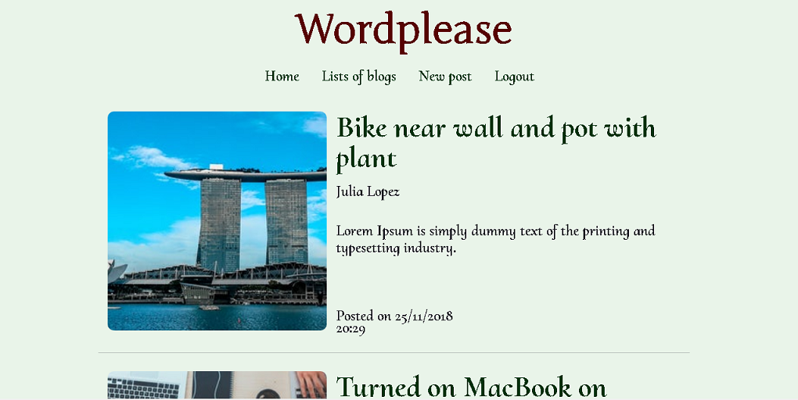
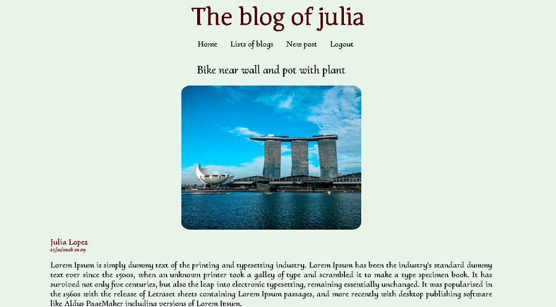

<p align=center></p>

A blog platform web app backend and API for made with Python and Django 

## Installation

Download the repository from GitHub

```
git clone https://github.com/MMartinOrtu/wordplease.git
``````

### Setup the virtual env

For Linux
```
virtualenv env
source env/bin/activate
```
For Windows
```
env/Scripts/activate
```

### Install  requirements
```
pip install -r requirements.txt
```
## Web URLs

+ `/` display a list of posts
+ `/blogs` display a list of blogs
+ `/blogs/<username>` display all the user's posts
+ `/blogs/<username>/<id>` display  post detail
+ `/new-post` to enter a new posts (authentication required)

+ `/login` to log in
+ `/logout` to log out
+ `/signup` to register a new user


## API REST 

### Users endpoints
+ ` POST  /api/1.0/users/` to create new user
+ ` GET / PUT / PATCH / DELETE  /api/1.0/users/id` display, update and delete users 

### Posts endpoints
+ ` GET  /api/1.0/posts/` display a list of all posts
+ ` GET / PUT / PATCH / DELETE  /api/1.0/posts/id` display, update and delete posts

### Blog endpoints

+ ` GET /api/1.0/blogs/` display a list of the existing blogs
+ ` GET /api/1.0/blogs/username/` display the posts of a user blog

### Authentication

Some endpoints require authentication and permissions.

### Filter and ordering data

Searching and ordering data are allowed in list endpoints

## Views

### Main
<p align=center></p>

### Detail page
<p align=center></p>